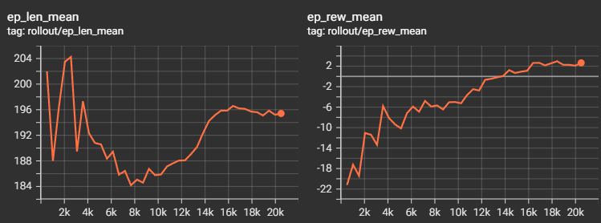

# HollowKnight_RL_PPO

- 上版本问题：模型不能很好的学到图像信息，来区分状态。分辨率 128, 160 可能不够。模型学的更多是向量状态，但其实也没太多有效信息。
- 症状表现为：训练 step 少的情况，一方面由于策略学习不充分，model predict 的 deterministic=True 情况下，会重复输出同一个动作复读。

### 尝试解决方案
- 只用图像状态：[3, 224, 224]，预训练 Resnet18，按 ImageNet 归一化到 [-3, 3]
- 动作加入黑冲，下砸，去掉输出效率低的上劈
- 黑冲，下砸实现：用 sb3_contrib 的 MaskablePPO，实现 action_masks 方法。
- 奖励分数：玩家血量，boss血量，结束额外奖惩。
- 先学了 2w step，

  

  

### V.8win_3lose
- 上版本代码问题：动作信号的生成和执行疑似不同步，由于不同动作动画时长不同，更新了细化的判断逻辑。应当等待当前动作执行完毕，再 step 采样下个动作。
- 上版本训练问题：approx_kl 策略变化过于剧烈，训练不稳定。正常范围 0.01-0.1，添加 kl 早停，target_kl=0.05。降低学习率，lr=2e-4。
- clip_fraction 裁剪比例过高，略更新过于激进。正常范围 0.1-0.3。减少每次rollout的训练轮数，n_epochs=4。
- 训练 8w step，模型学会了复读效率最高的招式：只用下劈，左劈，下砸三招，等 boss 冲过来碰瓷即可。
- 为什么学不好黑冲？推测没有给模型加黑冲限制，例如：如果面向 boss，且黑冲刚好撞上 boss。
- 未来工作：尝试加更多奖励限制，例如：让动作更有意义，判断是否面向 boss，判断和 boss 保持在特定距离。（个人不希望在早期版本加入过多限制）

  

  

  

